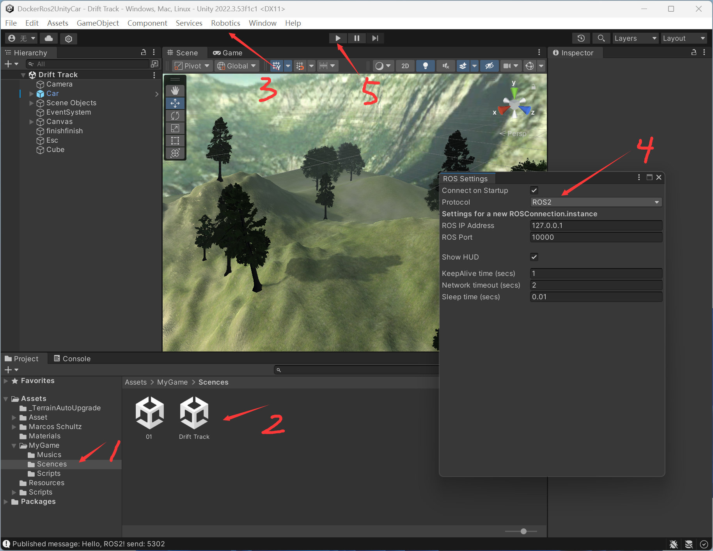
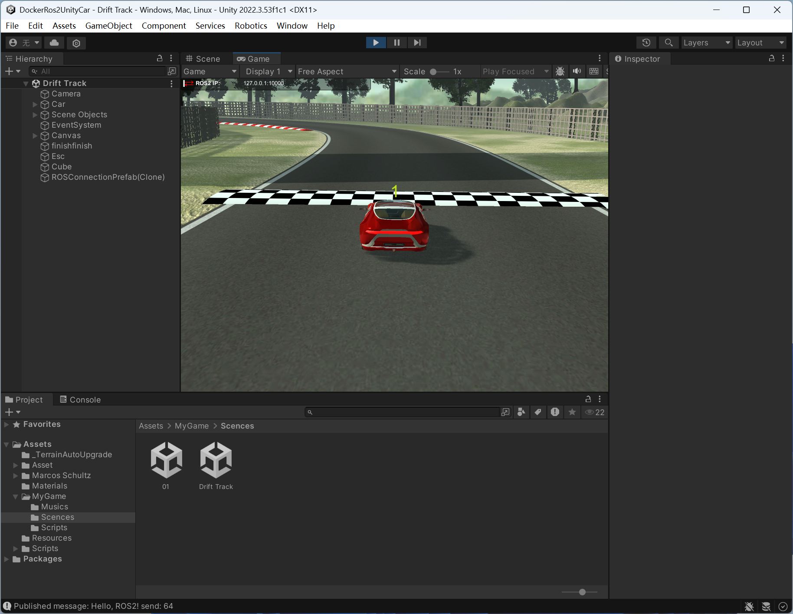
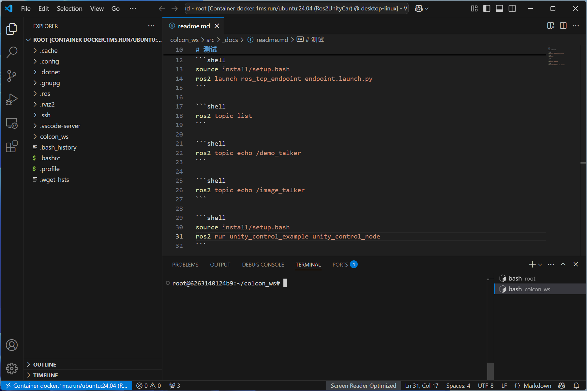

---


## 前言（Introduction）

使用gazebo仿真可以进行机器人与环境交互的仿真，但是仿真环境搭建起来比较复杂，尤其是对于初学者来说，并且难以构建复杂的仿真环境。因此，使用Unity搭建仿真环境会更加简单，并且可以构建更加复杂的仿真环境。

反正我用gazebo有时候挺抓狂的，各种报错。

> 参考：
> - [docker-ros2-unity-tcp-endpoint](https://github.com/frankjoshua/docker-ros2-unity-tcp-endpoint/tree/master)
> - [Robotics-Nav2-SLAM-Example](https://github.com/Unity-Technologies/Robotics-Nav2-SLAM-Example?tab=readme-ov-file)
> - [unity坐赛车游戏，简单三分钟了解一下](https://www.bilibili.com/video/BV1LU4y1o7re/?vd_source=3bf4271e80f39cfee030114782480463)
> - [How to Setup Unity and ROS2 in less than 5 minutes!](https://www.youtube.com/watch?v=1X6uzrvNwCk)
> - [ros2-for-unity](https://github.com/RobotecAI/ros2-for-unity)
> - [moveit2_yolobb_ws](https://github.com/laoxue888/moveit2_yolobb_ws)
> - [Unity-Robotics-Hub](https://github.com/Unity-Technologies/Unity-Robotics-Hub)


## 搭建开发环境（Setup Development Environment）

> - Unity:2020
> - Ubuntu:24.04
> - Ros2:jazzy

## 在window中安装Unity（Install Unity in window）

先安装Unityhuyb，然后再安装Unity

[https://unity.cn/releases](https://unity.cn/releases)

## 创建Docker容器，并安装相关软件（Create Docker containers and install related software）

❇️创建Docker容器

```shell
docker run -it -p 6080:80 -p 10000:10000 -v /tmp/.X11-unix:/tmp/.X11-unix -e DISPLAY=host.docker.internal:0.0 --gpus=all --name=Ros2UnityCar docker.1ms.run/ubuntu:24.04  /bin/bash
```

😂【可选】介绍另外一种方法：借助Docker的网页桌面功能，可以不用安装vncserver。[docker-webtop](https://github.com/linuxserver/docker-webtop)

```shell
# 可选
docker run -d --name Ros2UnityCar --security-opt seccomp=unconfined --gpus=all -e PUID=1000 -e PGID=1000 -e TZ="Asia/Shanghai" -p 3000:3000 -p 3001:3001 -p 10000:10000 lscr.io/linuxserver/webtop:ubuntu-xfce # ubuntu:24.04 科学上网下载速度更快

# 查看Ubuntu版本的命令
lsb_release -a
```

❇️安装相关软件

```shell
# 按照鱼香ros一键安装ros2
apt-get update
apt install wget -y
wget http://fishros.com/install -O fishros && bash fishros

# 打开新的终端，安装gz
sudo apt-get update
sudo apt-get install curl lsb-release gnupg -y
sudo curl https://packages.osrfoundation.org/gazebo.gpg --output /usr/share/keyrings/pkgs-osrf-archive-keyring.gpg
echo "deb [arch=$(dpkg --print-architecture) signed-by=/usr/share/keyrings/pkgs-osrf-archive-keyring.gpg] http://packages.osrfoundation.org/gazebo/ubuntu-stable $(lsb_release -cs) main" | sudo tee /etc/apt/sources.list.d/gazebo-stable.list > /dev/null
sudo apt-get update -y
sudo apt-get install gz-harmonic -y

# 安装远程显示服务程序
apt-get install x11-xserver-utils
apt install libxcb* -y
apt-get install x11-apps -y

# 安装moveit
apt install ros-${ROS_DISTRO}-moveit* -y

# 安装ros2的控制功能包
sudo apt install ros-${ROS_DISTRO}-controller-manager -y
sudo apt install ros-${ROS_DISTRO}-joint-trajectory-controller -y
sudo apt install ros-${ROS_DISTRO}-joint-state-broadcaster -y
sudo apt install ros-${ROS_DISTRO}-diff-drive-controller -y

# 安装其他功能包
# apt install ros-${ROS_DISTRO}-ros-gz -y
apt-get install ros-${ROS_DISTRO}-joint-state-publisher-gui -y
apt install ros-${ROS_DISTRO}-moveit-ros-planning-interface -y
# apt install ros-jazzy-gz-ros2-control 这个很重要 https://github.com/ros-controls/gz_ros2_control
apt install ros-${ROS_DISTRO}-gz-ros2-control -y

# 用于调试，可不安装
apt-get install gdb -y

# 安装python第三方库
apt install python3-pip -y
pip config set global.index-url https://pypi.tuna.tsinghua.edu.cn/simple
pip install pyside6 xacro ultralytics NodeGraphQt --break-system-packages
pip install -U colcon-common-extensions vcstool --break-system-packages

pip install pygame --break-system-packages
```

## 运行测试（Run test）

❇️打开Unity项目





❇️打开ROS2项目




