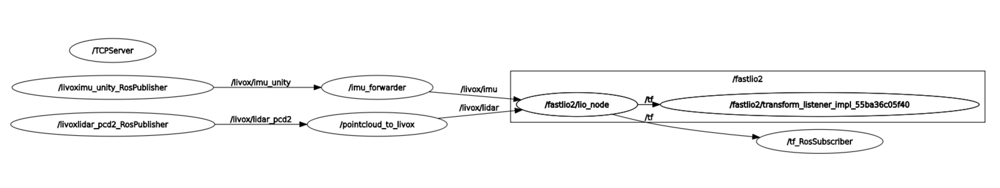

# 环境配置

❇️安装ros2

【引用文章】

❇️安装重要的第三方库

```shell
sudo apt-get install ros-humble-rqt-tf-tree
apt-get install gdb -y
apt-get install ros-${ROS_DISTRO}-pcl-ros
```


# 运行测试

## Unity3D传感器数据获取测试


```shell
source install/setup.bash 
ros2 launch ros_tcp_endpoint endpoint.launch.py
```

```shell
source install/setup.bash
ros2 run topic_converter_python image_unconpressed
```

```shell
rviz2
```


## FAST_LIO-Unity3D运行测试

> ⚠️注意：需要一个静态的`frame`

```shell
source install/setup.bash 
ros2 launch ros_tcp_endpoint endpoint.launch.py
```

```shell
source install/setup.bash
ros2 run topic_converter pointcloud_to_livox

source install/setup.bash
ros2 run topic_converter imu_forwarder
```

```shell
source install/setup.sh
ros2 launch fast_lio mapping.launch.py config_file:=mid360.yaml
```

> 测试结果：小车速度快后会发散。

## FAST_LIO2 rosbag运行测试

```shell
# cd ws_livox
source install/setup.bash
ros2 bag play /root/rosbag2_2024_06_20-16_46_47/rosbag2_2024_06_20-16_46_47_0.db3
```

```shell
source install/setup.bash 
ros2 launch fastlio2 lio_launch.py
```

> 测试结果：成功。

## FAST_LIO2-Unity3D运行测试

```shell
source install/setup.bash 
ros2 launch ros_tcp_endpoint endpoint.launch.py
```

```shell
source install/setup.bash
ros2 run topic_converter pointcloud_to_livox

source install/setup.bash
ros2 run topic_converter imu_forwarder
```

```shell
source install/setup.bash 
ros2 launch fastlio2 lio_launch.py
```

> 测试结果：未成功。

# 调试工具

```shell
ros2 run rqt_tf_tree rqt_tf_tree --force-discover

rqt
```

❇️节点图的状态是好的




