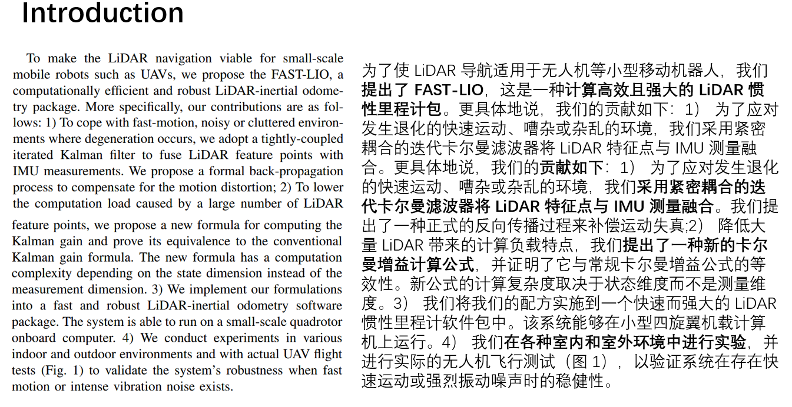
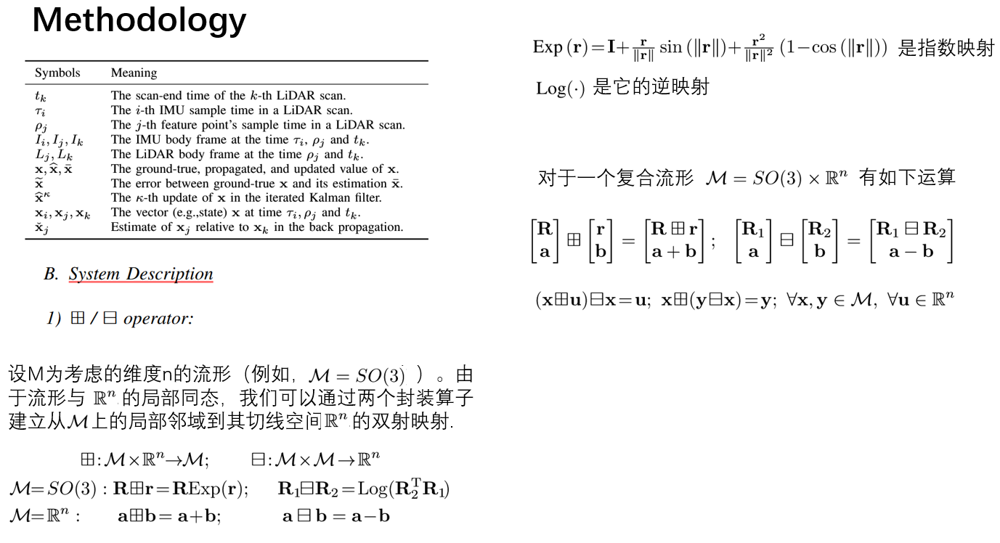
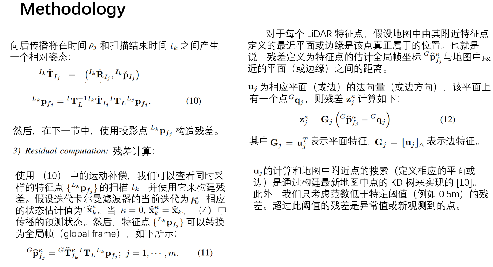

---

# 前言

**FAST_LIO**提出了一个计算高效且稳健的 LiDAR 惯性里程计框架。使用紧密耦合的迭代扩展卡尔曼滤波器将 LiDAR 特征点与 IMU 数据融合，以便在发生退化的快速运动、嘈杂或杂乱的环境中实现稳健的导航。

**FAST_LIO2**提出了一个快速、强大且多功能的 LiDAR 惯性里程计框架。FASTLIO2 基于高效的紧密耦合迭代卡尔曼滤波器构建，具有两个关键的新颖性，可实现快速、稳健和准确的 LiDAR 导航（和映射）。

**FAST-LIO2相对于FAST-LIO来说**，改进的地方是：（1）去掉了特征提取模块，直接使用点云。（2）使用ikd-tree存储点云。

**本文介绍了FAST_LIO原理，并搭建了FAST-LIO和FAST-LIO2的运行环境，方便学习FAST-LIO算法。**

# FAST-LIO原理介绍











# 运行环境配置

> 环境要求：
> - ubuntu:22.04
> - ros2:humble

❇️创建Docker容器

```shell
docker run -it -p 6080:80 -p 10000:10000 -v /tmp/.X11-unix:/tmp/.X11-unix -e DISPLAY=host.docker.internal:0.0 -e PULSE_SERVER=host.docker.internal --name=DockerUnityRos2Car4 docker.1ms.run/ubuntu:22.04  /bin/bash
```

❇️安装ros2

```shell
apt update

apt-get install sudo -y
sudo apt install software-properties-common -y

sudo add-apt-repository universe # 按后面Enter

sudo apt update && sudo apt install curl gnupg2 -y
sudo curl -sSL https://gitee.com/tyx6/rosdistro/raw/master/ros.key -o /usr/share/keyrings/ros-archive-keyring.gpg

echo "deb [arch=$(dpkg --print-architecture) signed-by=/usr/share/keyrings/ros-archive-keyring.gpg] http://packages.ros.org/ros2/ubuntu $(. /etc/os-release && echo $UBUNTU_CODENAME) main" | sudo tee /etc/apt/sources.list.d/ros2.list > /dev/null
apt install curl gnupg2 -y

# 这一步先打开科学上网，不然会报错
curl -sSL https://raw.githubusercontent.com/ros/rosdistro/master/ros.key -o /usr/share/keyrings/ros-archive-keyring.gpg

# 这一步先关闭科学上网，不然会报错
sudo apt update && sudo apt upgrade -y
sudo apt install ros-humble-desktop -y
``` 

❇️添加终端启动sh

```shell
echo "source /opt/ros/humble/setup.bash" > ~/.bashrc
```


❇️安装第三方库

```shell
# 重新开一个终端
sudo apt install python3-colcon-common-extensions -y   
sudo apt-get install ros-humble-rqt-tf-tree -y
apt-get install gdb -y
apt-get install ros-${ROS_DISTRO}-pcl-ros -y
```

❇️安装驱动库

```shell
# git clone https://github.com/Livox-SDK/Livox-SDK2.git
cd third_party_libraries/Livox-SDK2
mkdir build
cd build
cmake .. && make -j
sudo make install
```

```shell
# git clone https://github.com/strasdat/Sophus.git
cd third_party_libraries/Sophus
# git checkout 1.22.10
mkdir build 
cd build
cmake .. -DSOPHUS_USE_BASIC_LOGGING=ON
make
sudo make install
```

```shell
# git clone https://github.com/borglab/gtsam.git
#!bash
cd third_party_libraries/gtsam
mkdir build
cd build
cmake ..
# make check # make check只是在你安装之前对你的环境以及源码等进行检测以确保编译安装正确的，你可以跳过这一步
sudo make install
```

❇️编译

第一次编译

```shell
cd 2_replicate_fast_lio_two_version/src/livox_ros_driver2
sudo chmod +x build.sh
./build.sh humble
```

第二次开始

```shell
cd 2_replicate_fast_lio_two_version/
colcon build
```

# 运行测试

## 数据下载

（1）百度网盘下载


链接: https://pan.baidu.com/s/1ILQ2WnI81AxU89gmk92zww?pwd=n5r3 提取码: n5r3 


[（2）Google网盘下载: https://drive.google.com/drive/folders/1CGYEJ9-wWjr8INyan6q1BZz_5VtGB-fP](https://drive.google.com/drive/folders/1CGYEJ9-wWjr8INyan6q1BZz_5VtGB-fP)

## FAST_LIO算法运行测试

```shell
cd 2_replicate_fast_lio_two_version
source install/setup.bash
ros2 bag play /root/2_replicate_fast_lio_two_version/src/docs/place_data_here/rosbag2_2024_06_20-16_46_47
```

```shell
cd 2_replicate_fast_lio_two_version
source install/setup.sh
ros2 launch fast_lio mapping.launch.py config_file:=mid360.yaml
```


## FAST_LIO2算法运行测试

```shell
cd 2_replicate_fast_lio_two_version
source install/setup.bash
ros2 bag play /root/2_replicate_fast_lio_two_version/src/docs/place_data_here/rosbag2_2024_06_20-16_46_47
```

```shell
cd 2_replicate_fast_lio_two_version
source install/setup.bash 
ros2 launch fastlio2 lio_launch.py
```


# 參考

- [FAST-LIO: A Fast, Robust LiDAR-inertial Odometry Package by Tightly-Coupled Iterated Kalman Filter](http://arxiv.org/abs/2010.08196)
- [Ericsii/FAST_LIO_ROS2: ROS2 version of FAST_LIO2](https://github.com/Ericsii/FAST_LIO_ROS2)
- [livox-mid360激光雷达三维重建川大校园_哔哩哔哩_bilibili](https://www.bilibili.com/video/BV1xL41117rx/)
- [FAST-LIO论文解读与详细公式推导](https://zhuanlan.zhihu.com/p/587500859)
- [雷达惯性里程计论文阅读笔记—FAST-LIO2 （二）](https://zhuanlan.zhihu.com/p/471876531)